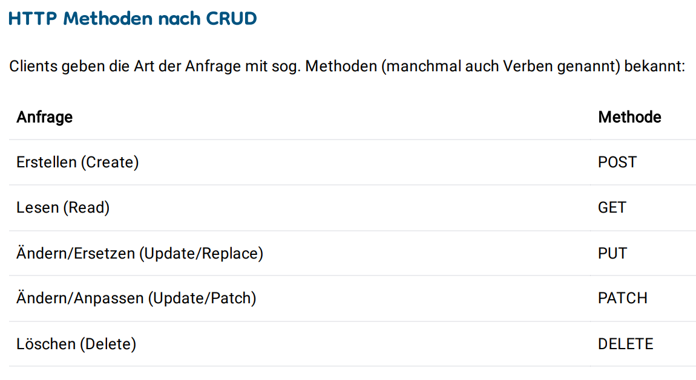
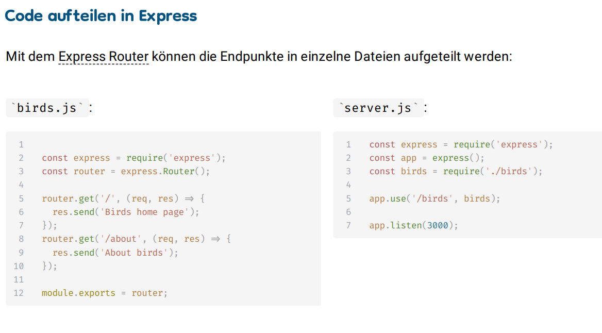

### NOTIZEN ÜK M295

Block 2: 
- Asynchrone Programmierung
  - Asynchrone Programmierung ermöglicht das gleichzeitige Ausführen mehrerer Aufgaben, ohne den Ablauf des Hauptprogramms zu blockieren.
  - Callbacks: Funktionen, die nach Abschluss einer Aufgabe aufgerufen werden
  - Promises: Objekte, die den Erfolg oder Misserfolg einer asynchronen Operation repräsentieren
  - Async/Await: Moderne Syntax, um asynchrone Funktionen übersichtlicher zu gestalten
---
Block 3:
- HTTP Schnittstellen
  - Address: Die eindeutige URL (Uniform Resource Locator), die eine Ressource oder einen Endpunkt im
  - Web identifiziert, zu dem die HTTP-Anfrage gesendet wird (z.B. https://example.com/api/users).
  - Headers: Schlüssel-Wert-Paare, die zusätzliche Informationen über den HTTP-Anforderer und die Anfrage selbst enthalten (z.B. Content-Type, Authorization)
  - Methods: HTTP-Verben, die angeben, welche Aktion auf der angeforderten Ressource durchgeführt werden soll (z.B. GET, POST, PUT, DELETE).
  - Body: Daten, die bei bestimmten HTTP-Methoden (z.B. POST, PUT) an den Server gesendet werden, um Ressourcen zu erstellen oder zu aktualisieren.
  - Status Codes: Dreistellige Zahlen, die das Ergebnis der HTTP-Anfrage anzeigen (z.B. 200 OK, 404 Not Found, 500 Internal Server Error).
- HTTP Protokoll
  - Seit Anfang an die Art, wie der Browser mit dem WWW spricht Client/Server mit Request/Response
  - Stateless
  - Sicher nur Dank der Erweiterung HTTPS
  - Standardports (HTTP: 80; HTTPS: 443) werden im Browser nicht angezeigt
---
Block 4:

---
Block 5:
- Array funktionen
  - Array-Funktionen: find , filter , map , reduce , …
  - Die folgenden Funktionen sind nützlich um Arrays zu bearbeiten:
  - find gibt das erste Element zurück, worauf eine Bedingung zutrifft.
  - filter entfernt Elemente auf die eine Bedingung zutrifft und gibt das Resultat als neues Array zurück.
  - map transformiert jedes Element und gibt ein neues Array zurück.
  - reduce leitet ein Ergebnis von allen Elementen eines Arrays ab und gibt dieses zurück.
---
Block 6:
- DerZweckvon OpenAPI /Swagger
  - Die OpenAPI Spezifikation ist ein Standard zur Beschreibung und Dokumentation von REST-APIs
  - Die Swagger Open Source Tools können die Spezifikation dann verwenden, um z.B. Interaktive Dokumentationen oder ganze Clients in diversen Programmiersprachen automatisch zu generieren.
  - Der Swagger Editor kann verwendet werden, um die Spezifikation interaktiv zu erstellen.
---
Block 7:
- Authenticationvs. Authorization
  - Authentication stellt sicher, dass ein Benutzer derjenige ist, den er vorgibt zu sein (authentisch)
  - Authorization stellt sicher, dass ein Benutzer nur das machen kann, was er darf (autorisiert)
- Artenvon Wiedererkennungsmerkmalen
  - Mit einem Cookie, welches vom Browser verwaltet und mitgegeben wird
  - Mit einem Token und dem «Authorization» Request Header (z.B. JWT)
  - Mit der «HTTP Basic Authentication», welche ebenfalls vom Browser verwaltet wird
- Authentication mit einem Session-Cookie
  - Der Server generiert für jeden Benutzer ein zufälliges, eindeutiges Cookie, welche mit dem Set-Cookie Response Header mitgeschickt wird.
  - Der Server führt eine Liste mit allen vergebenen Cookies und verknüpft es mit zusätzlichen Informationen.
  - Der Client gibt das Cookie bei jedem Request
  - Man spricht dann von einer Session und einem «Session-Cookie»
  - Loggt sich ein Benutzer mit den richtigen Credentials ein, so wird Session mit der entsprechenden Benutzer-ID verknüpft.
  - Der Server weiss damit, dass diese Session zu demjenigen Benutzer gehört, solange das Cookie mitgeschickt wird
  - Die verknüpften Daten werden nicht im Cookie mitgeschickt
  - SLIDE 110
---
Block 8:
- ESLINT
